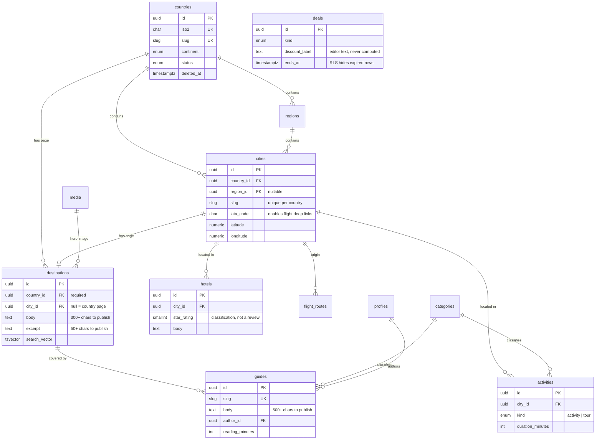
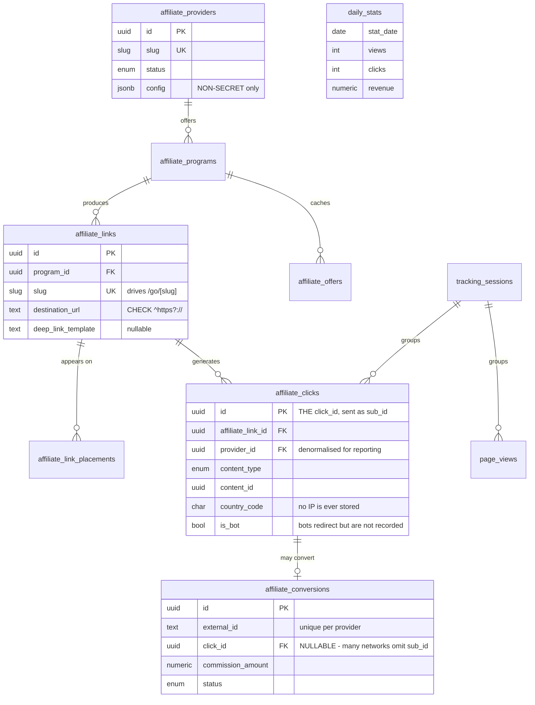
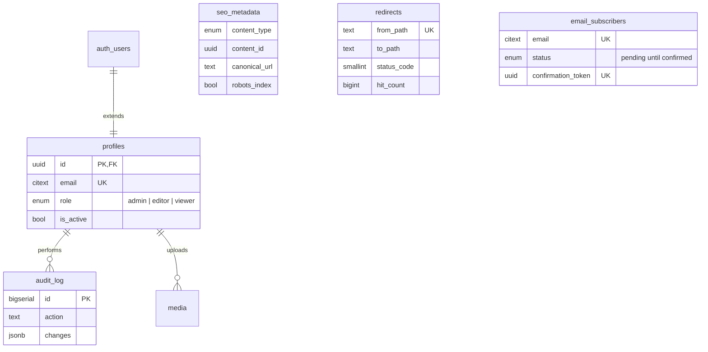

# Entity Relationship Diagram

Generated from the live schema. See [database.md](database.md) for the reasoning
behind these structures.

---

## Editorial content

**The destination shape is the load-bearing decision.** One table serves both
`/destinations/{country}` and `/destinations/{country}/{city}`: `city_id` null
means a country page. Two partial unique indexes enforce one row of each kind.
That is why both URLs are one code path rather than two.

**No price, availability, rating or review column exists** on `hotels`,
`activities` or `flight_routes`. A schema with nowhere to put a fabricated
figure cannot accidentally publish one.

---

## Affiliate and tracking

Two constraints here do real work:

- `affiliate_links.destination_url` must match `^https?://`. A `javascript:`,
  `data:` or relative value can never reach the redirector, so an open redirect
  is structurally impossible rather than merely guarded against in code.
- `affiliate_conversions.click_id` is nullable. An unattributable conversion must
  stay visibly unattributed.

---

## Identity, SEO and system

`seo_metadata`, `content_tags` and `affiliate_link_placements` reference content
polymorphically via `(content_type, content_id)` and carry **no foreign key**.
That is a conscious trade: one join table across ten entities is worth more than
ten per-entity tables, at the cost of referential integrity the application must
maintain.

`profiles.id` references `auth.users` with `on delete cascade`, and a trigger
mirrors new auth users into `profiles`. **The first user to sign up becomes
admin**, so the dashboard is reachable on a fresh install; everyone after
defaults to `viewer`.

`audit_log` has no update or delete policy for any role.
